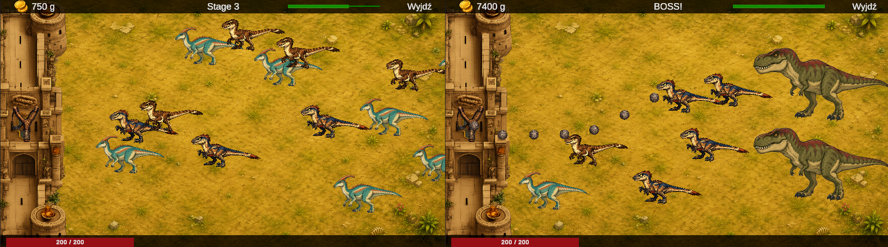

# Tower Defense Game - Unity

A 2D tower defense / castle defense game created in Unity.

The player defends a castle from incoming enemies, earns gold, upgrades weapon stats in the shop, and progresses through stages with increasing difficulty.

## Core Idea

The game is planned around era-based progression and evolution.

The first era is inspired by dinosaurs and ancient civilization themes. After unlocking the required upgrades and reaching specific progression goals, the player will be able to evolve to the next era.

Each evolution will introduce new visuals, enemies, upgrades and gameplay elements, eventually leading toward a final cosmic / galactic era.

## Features

- 2D castle defense gameplay
- Enemy spawning system
- Projectile-based shooting
- Castle health system
- Persistent gold system
- Shop with permanent upgrades
- Stage progression
- Boss enemy support
- Game over and stage completion screens
- Unity UI with gold, progress and upgrade stats
- Planned era evolution system

## Gameplay

Enemies spawn from the right side of the screen and move toward the castle on the left.

The player attacks enemies using a weapon. Defeated enemies reward gold, which can be spent in the shop to improve player stats.

Available and planned upgrades include:

- Damage
- Reload speed
- Projectile speed
- Projectile size
- Projectile count
- Castle health
- Critical hit chance
- Knockback strength
- Additional castle parts
- Skills and special abilities

## Planned Systems

The game is currently in development and more systems are planned, including:

- Era evolution system
- New enemy types
- Boss enemies
- Skills and active abilities
- Castle expansions such as fortress parts, lava, towers and other defensive elements
- Monster-based upgrade effects
- Temporary or permanent boosts such as faster attack speed
- Double gold rewards
- More shop upgrades
- Improved animations and visual effects
- Sound effects and background music

## Technologies

- Unity
- C#
- 2D Physics
- ScriptableObjects
- PlayerPrefs
- Unity UI
- TextMeshPro

## Project Status

This project is currently in development.

## Author

Created by Eryk Potocki.